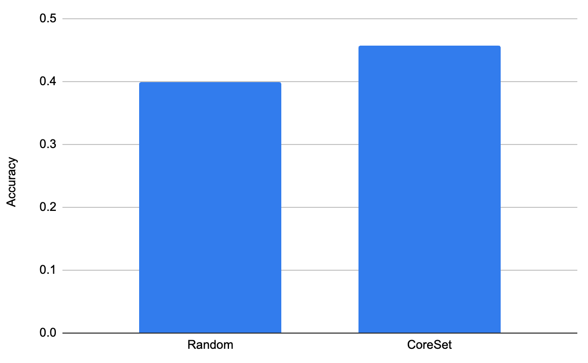

<p align="center">
    <b>Find hallucination prone prompts and use them to fine-tune / ground your LLM</b>
</p>

<p align="center">
    
    <a href="https://pypi.org/project/anchor-gpt/"></a>
    </img></a>
</p>


## Why Anchor GPT ?

Because you can't get groundtruth answers for every prompt and fine-tuning / grounding with the right data gives much better results. We compared side by side fine-tuning with prompts sampled randomly and with CoreSet (the core algo of anchor-gpt) and the results speak for themselves 👇
<p align="center">
    
    <br>
    <i>Accuracy on a sample of the MMLU test dataset of a fine tuned LLama with 1000 datapoints sampled from the Alpaca dataset using either Random sampling or CoreSet</i>
</p>

## Installation

```bash
pip install anchor-gpt
```

## Step by Step
1. Use prompt logger to log your prompts and their grouding scores
```python
from anchor_gpt import PromptLogger, Prompt

# Your regular grounding process
prompt_embeddings = embedding_model.encode(prompt)
index_response = my_index_endpoint.find_neighbors(
    queries=prompt_embeddings,
    num_neighbors=10,
)

grounding_data = []
grounding_distances = []
for grounding_index, grounding_distance in index_response:
    grounding_data.append(my_index_endpoint.get(grounding_index))
    grounding_distances.append(grounding_distance)

grounded_prompt = build_prompt(prompt, grounding_data)

# Call your LLM
chat_response = my_llm.chat(grounded_prompt, temperature=0.1)


# Log the prompt
prompt_logger = PromptLogger()
my_prompt = prompt_logger.log(Prompt(
    text=prompt,
    response=chat_response,
    scores={'grounding_distances': grounding_distances},
    embeddings=prompt_embeddings,
))
```

2. Add additional scores like user feedback asynchronously
```python
my_prompt.update_scores({'user_feedback': 0.8})
```

3. Retreive the worst performing prompts to fine-tune your model or improve your grounding database

```python
# Define a custom prompt scoring method
def retriever(store, threshold):
    def prompt_average_score(prompt):
        return 0.2 * prompt.scores['grounding_distances'][0] + 0.8 * prompt.scores['user_feedback']

    return list(filter(lambda x: prompt_average_score(x) > threshold, store.select_prompts()))

# Retreive the ones above a threshold
worst_prompts = prompt_logger.retrieve(retriever, 0.5)
# Remove near duplicates to only keep what matters
deduped_prompts = prompt_logger.deduplicate(worst_prompts, 100)

# Add the right answers to your grounding DB to better answer those prompts next time
```

## Example in a chat service

```python
from anchor_gpt import PromptLogger, Prompt

prompt_logger = PromptLogger()

# Your regular chat endpoint with logging enabeled
@app.route("/chat", methods=["POST"])
def chat():
    # Do your grounding as normal:
    prompt_embeddings = model.encode(request.json["prompt"])
    vector_store_results = vector_store.query(prompt_embeddings, top_k=10)

    grounded_prompt = build_prompt(prompt, vector_store_results)
    chat_response = my_llm.chat(grounded_prompt, temperature=0.1)

    # Then log the prompt with the response, scores and embeddings.
    # Prompts are stored locally in a SQLite database.
    prompt_logger.log(Prompt(
        text=request.json["prompt"],
        response=chat_response,
        scores={'grounding_distances': [r.distance for r in vector_store_results]},
        embeddings=prompt_embeddings,
    ))

    return chat_response

# A new hallucination retreival endpoint to get the worst prompts from your LLM
@app.route("/hallucinations", methods=["GET"])
def hallucinations():
    def retriever(store, threshold):
        def prompt_average_score(prompt):
                return prompt.scores['grounding_distances'][0]
            return list(filter(lambda x: prompt_average_score(x) > threshold, store.select_prompts()))

    # Retrieve a list of the prompts with the greated distance from your grounding data
    worst_prompts = prompt_logger.retrieve_n(0.5)

    # Remove near duplicates and only keep 10 prompts
    deduped_prompts = prompt_logger.deduplicate(worst_prompts, 10)

    # Clean up the store
    prompt_logger.store.purge()

    return jsonify([{'text': p.text, 'response': p.response} for p in deduped_prompts])
```